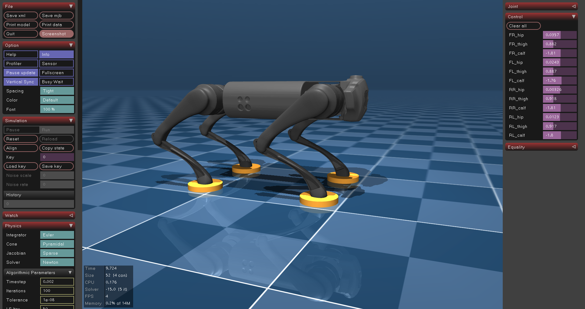

# MuJoCo Project - Unitree Go1 Robot Simulation

This project demonstrates MuJoCo physics simulation using the Unitree Go1 quadruped robot model. It includes both interactive viewer demos and Jupyter notebook tutorials for robotics simulation and visualization.

## 📸 Preview

### Screenshot



### Demo Video

<video width="640" height="480" controls>
  <source src="output.mp4" type="video/mp4">
  Your browser does not support the video tag. 
  <a href="output.mp4">Download the demo video</a>
</video>

_The demo video shows the Unitree Go1 robot simulation with smooth camera rotation and dynamic control perturbations._

> **Note:** If the video doesn't display above, you can [click here to download it](output.mp4) or view it directly in your file browser.

## 🚀 Project Overview

This repository contains:

- **MuJoCo physics simulation** of the Unitree Go1 robot
- **Interactive viewer demos** with real-time visualization
- **Jupyter notebook tutorials** for learning MuJoCo
- **Video rendering capabilities** for creating simulation outputs

## 📁 Project Structure

```
MuJoCo Project/
├── tutorial.ipynb              # Jupyter notebook with MuJoCo tutorial
├── mujoco_viewer_demo.py       # Interactive viewer demonstration
├── interactive_viewer.py       # Additional interactive viewer script
├── requirements.txt            # Python dependencies
├── .gitignore                 # Git ignore rules
├── README.md                  # Project documentation
├── MJDATA.TXT                 # MuJoCo debug/memory data
├── output.mp4                 # 🎥 Generated simulation video
├── screenshot.png             # 📸 Project screenshot
├── venv/                      # Python virtual environment
└── unitree_go1/               # Unitree Go1 robot model
    ├── go1.xml                # Main robot model file
    ├── scene.xml              # Complete scene with robot
    ├── go1.png                # Robot image
    ├── assets/                # Robot mesh files
    │   ├── calf.stl
    │   ├── hip.stl
    │   ├── thigh.stl
    │   ├── thigh_mirror.stl
    │   └── trunk.stl
    ├── CHANGELOG.md
    ├── LICENSE
    └── README.md
```

## 🛠️ Setup Instructions

### Prerequisites

- Python 3.8 or higher
- Git (optional, for cloning)

### Installation

1. **Clone or download the project**

   ```bash
   git clone <your-repo-url>
   cd "MuJoCo Project"
   ```

2. **Create and activate virtual environment**

   ```bash
   # Create virtual environment
   python -m venv venv

   # Activate virtual environment
   # On Windows:
   .\venv\Scripts\activate

   # On macOS/Linux:
   source venv/bin/activate
   ```

3. **Install dependencies**

   ```bash
   pip install --upgrade pip
   pip install -r requirements.txt
   ```

4. **Verify installation**
   ```bash
   python -c "import mujoco, numpy, mediapy; print('Installation successful!')"
   ```

## 📦 Dependencies

The project uses the following main packages:

- **mujoco (≥3.0.0)** - Physics simulation engine
- **numpy (≥1.21.0)** - Numerical computations
- **mediapy (≥1.1.0)** - Media processing and visualization
- **tqdm (≥4.64.0)** - Progress bars
- **imageio (≥2.19.0)** - Video/image I/O
- **pathlib2 (≥2.3.0)** - Path handling utilities

See `requirements.txt` for the complete list with all dependencies.

## 🎮 Usage

### 1. Interactive Viewer Demo

Run the real-time interactive simulation:

```bash
python mujoco_viewer_demo.py
```

**Features:**

- Real-time physics simulation
- Interactive camera controls
- Smooth camera rotation around the robot
- Toggle between visual and collision geometries
- Keyboard controls:
  - `Space` - Pause/unpause simulation
  - `R` - Reset simulation
  - `V` - Toggle geometry display
  - `Esc` - Exit

### 2. Additional Interactive Viewer

```bash
python interactive_viewer.py
```

### 3. Jupyter Notebook Tutorial

Launch Jupyter and open the tutorial:

```bash
jupyter notebook tutorial.ipynb
```

**Tutorial includes:**

- MuJoCo basics and model loading
- Rendering and visualization techniques
- Camera control and animation
- Video generation and export
- Keyframe animation
- Physics parameter exploration

## 🎥 Video Generation

The tutorial notebook demonstrates how to:

1. Set up cameras with smooth rotation
2. Apply control noise for realistic motion
3. Blend between visual and collision geometries
4. Render high-quality videos
5. Export as MP4 files

**Example output:** [`output.mp4`](output.mp4) - A 10-second simulation showing the Unitree Go1 robot with dynamic motion and smooth camera work.

## 🤖 Robot Model: Unitree Go1

The project uses the Unitree Go1 quadruped robot model featuring:

- **12 degrees of freedom** (3 per leg)
- **Realistic joint limits** and dynamics
- **High-quality mesh models** for visual rendering
- **Collision geometries** for physics simulation
- **Multiple keyframes** for different poses

## 🔧 Customization

### Simulation Parameters

Key parameters you can modify:

```python
# In mujoco_viewer_demo.py or tutorial.ipynb
duration = 10.0          # Simulation duration (seconds)
ctrl_rate = 2            # Control update rate
ctrl_std = 0.05          # Control noise standard deviation
total_rot = 60           # Camera rotation (degrees)
fps = 60                 # Video frame rate
```

### Camera Settings

```python
camera.distance = 1.5    # Distance from robot
camera.azimuth = 0       # Horizontal angle
camera.elevation = -20   # Vertical angle
```

### Rendering Options

```python
# Resolution options
Resolution.SD = (480, 640)     # Standard definition
Resolution.HD = (720, 1280)    # High definition
Resolution.UHD = (2160, 3840)  # Ultra high definition
```

## 🐛 Troubleshooting

### Common Issues

1. **Import Error: No module named 'mujoco'**

   - Ensure virtual environment is activated
   - Reinstall with: `pip install mujoco>=3.0.0`

2. **OpenGL/Graphics Issues**

   - Update graphics drivers
   - Try software rendering: `export MUJOCO_GL=osmesa`

3. **Memory Issues**

   - Reduce video resolution
   - Decrease simulation duration
   - Close other applications

4. **Model Loading Errors**
   - Check that `unitree_go1/scene.xml` exists
   - Verify all mesh files are in `unitree_go1/assets/`

## 📊 Performance Notes

- **Simulation speed**: ~28 steps/second on typical hardware
- **Memory usage**: ~500MB for standard simulations
- **Video rendering**: Real-time for SD, slower for HD/UHD

## 🤝 Contributing

1. Fork the repository
2. Create a feature branch
3. Make your changes
4. Test thoroughly
5. Submit a pull request

## 📄 License

This project uses the Unitree Go1 model which has its own license terms (see `unitree_go1/LICENSE`).

## 🙏 Acknowledgments

- **MuJoCo** team for the excellent physics engine
- **Unitree Robotics** for the Go1 robot model
- **DeepMind** for MuJoCo development and maintenance

## 📞 Support

For issues and questions:

1. Check the troubleshooting section
2. Review MuJoCo documentation: https://mujoco.readthedocs.io/
3. Open an issue in this repository

---

**Happy Simulating! 🤖✨**
